# Adding and Configuring Custom Folders, Source Paths, and Include Paths in STM32CubeIDE

A practical step-by-step guide for integrating new folders into an existing STM32CubeIDE project.

# ------------------------------------ 
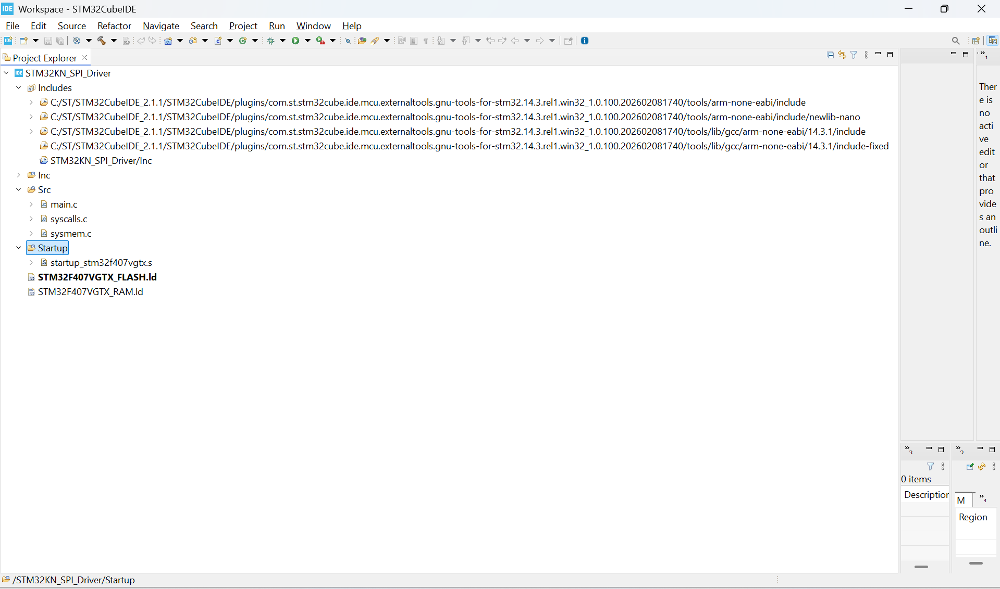
The setup is a new empty project

## Step 1: Create a New Folder Inside the Project
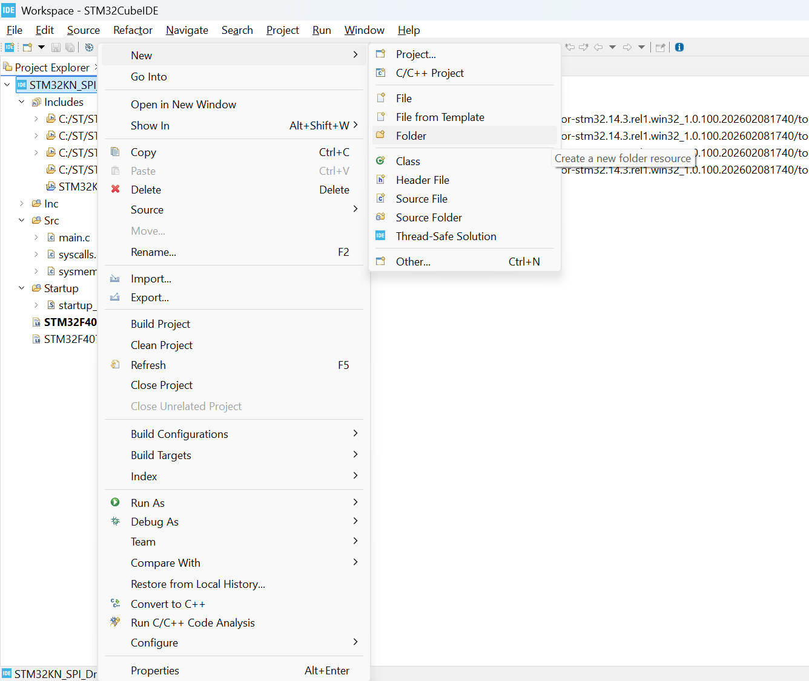
To add a custom folder, first right-click on the project name in the **Project Explorer**.

Then select:

`New > Folder`

This creates a normal folder inside the selected STM32CubeIDE project. The folder will appear in the Project Explorer and can be used to organize custom driver files, module files, headers, or any project-specific code.

At this stage, STM32CubeIDE only creates the folder. It does **not automatically mean** that `.c` files inside this folder will be compiled, or that `.h` files inside it will be available to the compiler.

For that, we must later configure:

- the source path, if the folder contains `.c` files
- the include path, if the folder contains `.h` files

This distinction is important because simply creating a folder is not enough for STM32CubeIDE to fully integrate it into the build system.

## Step 2: Enter the Folder Name
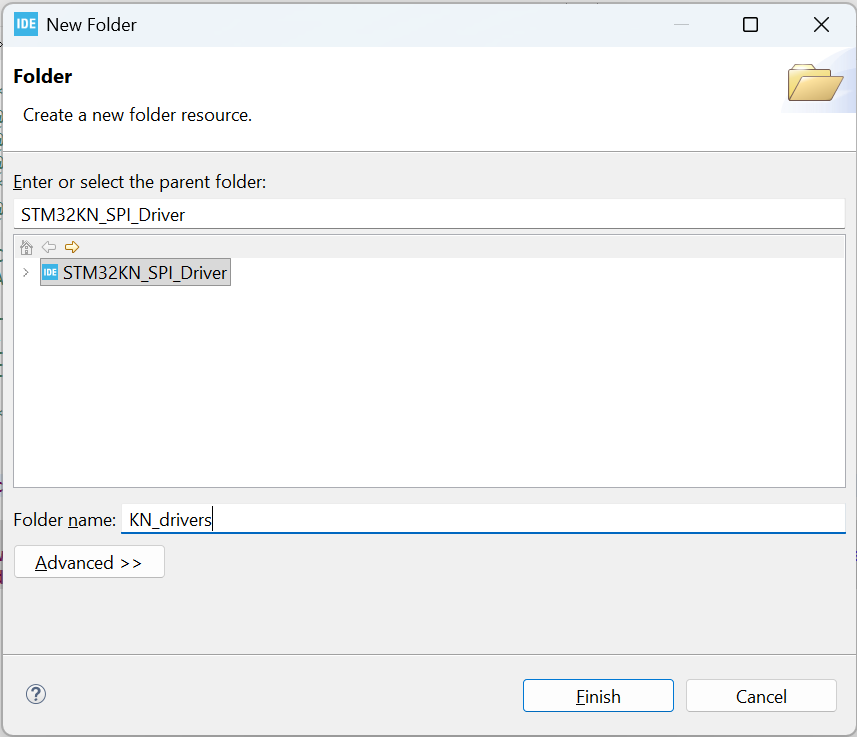
In the **New Folder** window, make sure the correct project is selected as the parent folder.

In this example, the parent project is:

`STM32KN_SPI_Driver`

Now enter the name of the new folder. Here, the folder name is:

`KN_drivers`

Then click **Finish**.

This creates the folder directly inside the project root.

After this step, the project structure will contain a new folder like this:

```text
STM32KN_SPI_Driver
|-- Inc
|-- Src
|-- Startup
`-- KN_drivers
```

This folder can now be used to store custom driver files or module-specific code. However, STM32CubeIDE still needs additional configuration before files inside this folder are properly used during compilation.

## Step 3: Create Subfolders Inside the Custom Folder
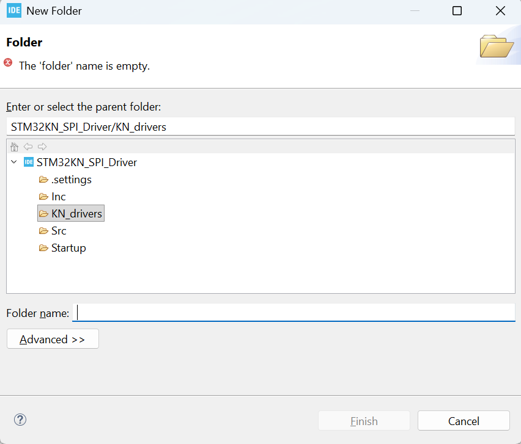
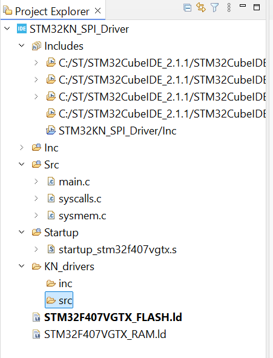
After creating the main custom folder, you can create more folders inside it.

For example, select the newly created folder:

`STM32KN_SPI_Driver/KN_drivers`

Then again choose:

`New > Folder`

Now the selected parent folder becomes:

`STM32KN_SPI_Driver/KN_drivers`

This allows us to create subfolders inside `KN_drivers`.

A common and clean structure is to separate header files and source files:

```text
KN_drivers
|-- Inc
`-- Src
```

Use:

- `Inc` for header files such as `.h`
- `Src` for source files such as `.c`

This keeps the custom driver code organized in the same style as STM32CubeIDE's default project structure.

At this stage, these folders are only created in the project tree. The compiler still does not automatically know that:

- `KN_drivers/Src` contains source files to compile
- `KN_drivers/Inc` contains header files to include

Those paths must be added in the project settings later.

## Step 4: Open the Folder Properties
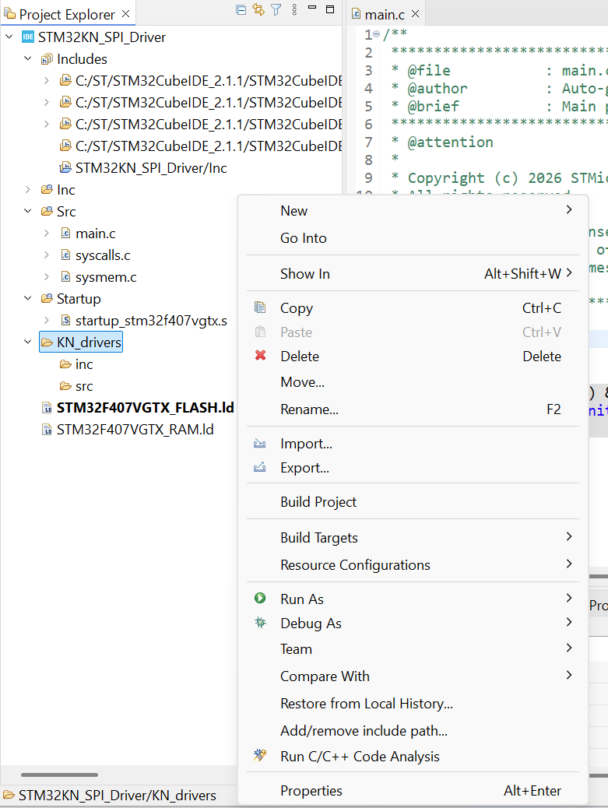

After creating the custom folder structure, right-click on the newly created folder.

In this example, right-click:

`KN_drivers`

Then select:

`Properties`

This is required because newly created folders may still be treated as normal project folders by STM32CubeIDE.

One important observation can be seen directly in the **Project Explorer**:

- the default `Src` folder has a small `C` type marking because CubeIDE recognizes it as a source-related folder
- the default project folders have IDE-specific folder icons
- the newly created `KN_drivers`, `inc`, and `src` folders only appear as normal folders

This tells us that the folders have been created, but they are not yet fully configured for the build system.

Before adding source and include paths, we should first check whether the new folder is excluded from the build. If **Exclude resource from build** is enabled, CubeIDE will ignore files inside that folder even if they are present in the project.

So the next step is to open the folder properties and remove the exclude-from-build check if it is enabled.

## Step 5: Check the C/C++ Build Settings
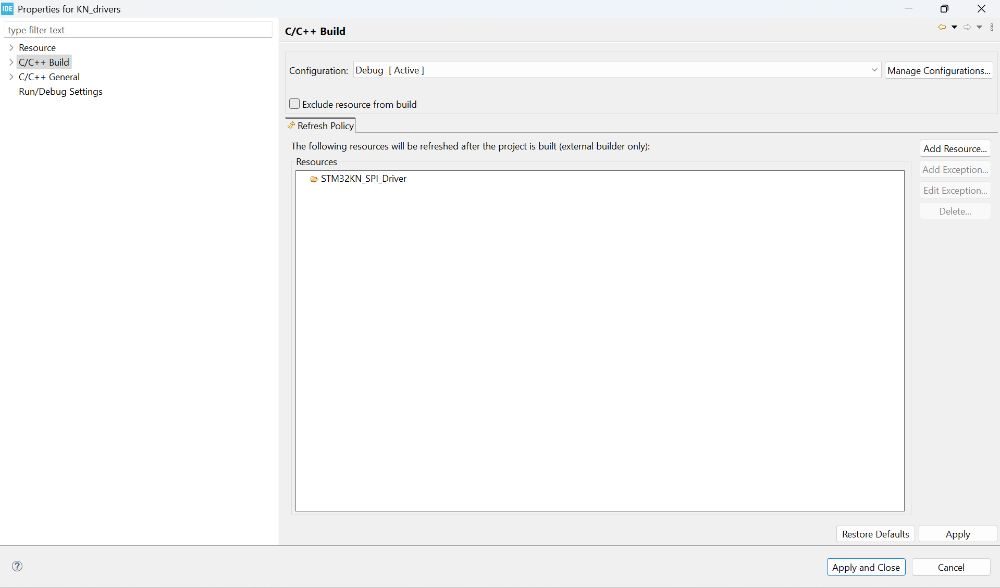

When the **Properties** window opens, maximize it so all settings are clearly visible.

In the left-side menu, select:

`C/C++ Build`

On this page, look for the option:

`Exclude resource from build`

Make sure this option is **unchecked**.

If this box is checked, STM32CubeIDE will exclude the selected folder from the build process. That means any `.c` files placed inside this folder will not be compiled, even though the files are visible in the Project Explorer.

For a custom driver folder such as:

`KN_drivers`

this option should normally remain unchecked, because we want the folder to be available for the project build.

After confirming this setting, click:

`Apply`

or:

`Apply and Close`

This step ensures that the new folder is not blocked from the build before we configure the actual source and include paths.

## Step 6: Open the Project Properties
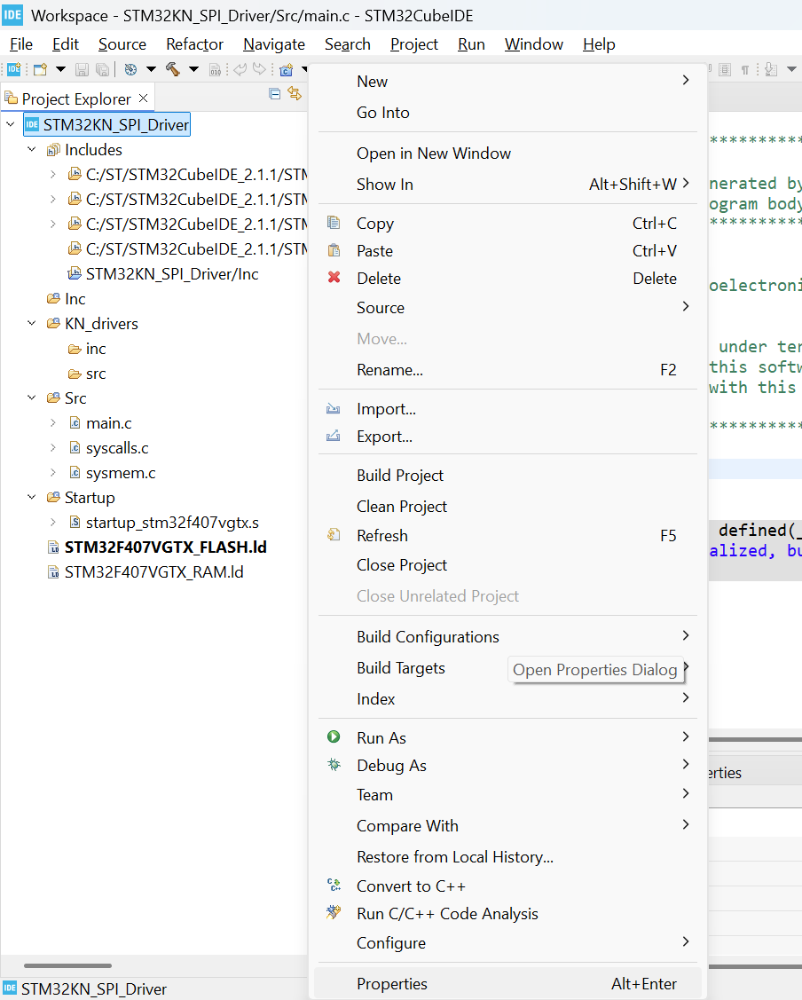

Removing **Exclude resource from build** is only the first check.

Even after doing that, the build can still fail if STM32CubeIDE does not know where the new source and header folders are located.

So now select the main project itself in the **Project Explorer**.

In this example, select:

`STM32KN_SPI_Driver`

Then right-click on the project and select:

`Properties`

This opens the project-level settings.

This is different from opening the properties of only `KN_drivers`. Folder properties are used to check whether that folder is excluded from the build. Project properties are used to configure the actual compiler and build paths.

From here, we will add the new custom folders to the correct build settings so that:

- `.c` files inside the custom `src` folder are compiled
- `.h` files inside the custom `inc` folder are found by the compiler

Without this project-level configuration, the files may exist in the Project Explorer but still fail during compilation.

## Step 7: Go to the Tool Settings Page
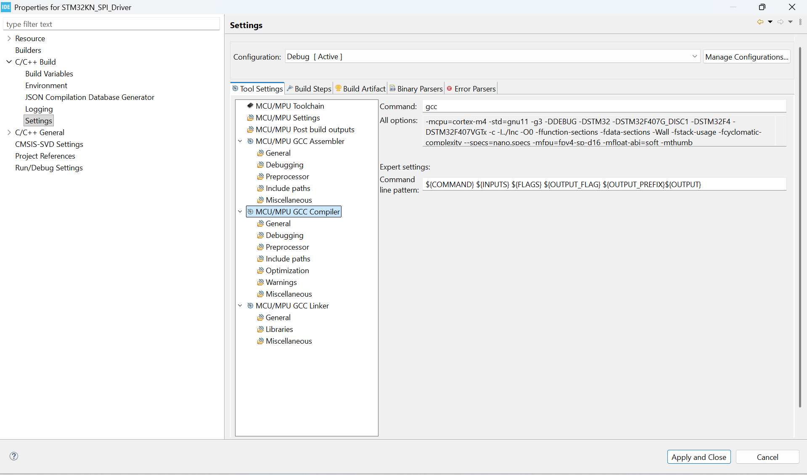

Inside the project **Properties** window, go to the build settings section.

In the left-side menu, expand:

`C/C++ Build`

Then select:

`Settings`

Now make sure the **Tool Settings** tab is selected.

In the tool list, expand the compiler section and select the highlighted option:

`MCU/MPU GCC Compiler`

This is the main compiler configuration area for the project.

From here, we can configure options that affect how the compiler sees the project, including include paths and other compiler-specific settings.

For now, stop at this screen and make sure:

- `C/C++ Build > Settings` is selected on the left
- `Tool Settings` is selected at the top
- `MCU/MPU GCC Compiler` is selected in the tool list

## Step 8: Open the Compiler Include Paths
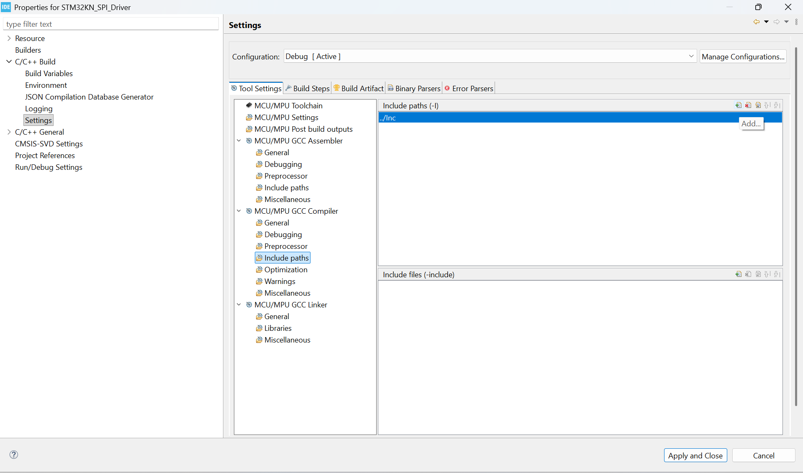

Inside the `MCU/MPU GCC Compiler` section, select:

`Include paths`

This page controls the compiler include paths.

Include paths tell the compiler where to search for header files when the code uses:

```c
#include "some_file.h"
```

The default project already has:

`../Inc`

This is why header files placed inside the default `Inc` folder are found automatically.

But our custom folder has its own header folder:

`KN_drivers/inc`

STM32CubeIDE does not automatically add this custom include folder. We must add it manually.

To add a new include path, click the **Add** button in the **Include paths (-I)** section.

This is the small add icon on the right side of the include path list.

## Step 9: Select the Custom Include Folder
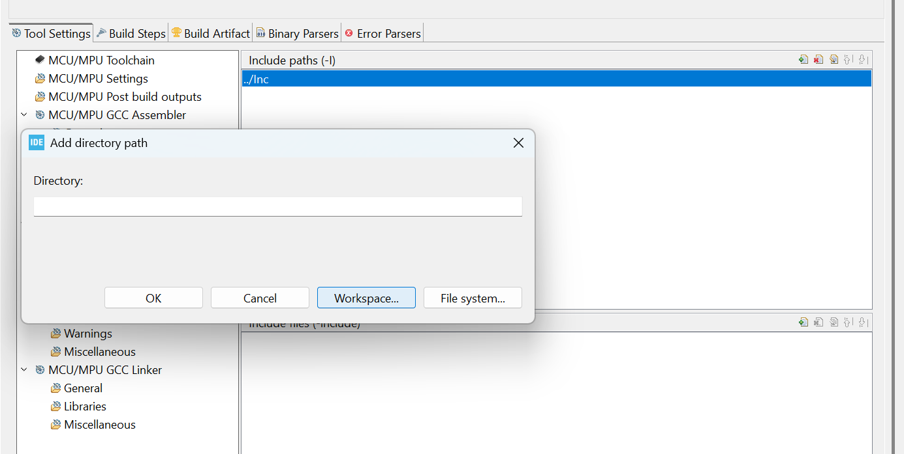
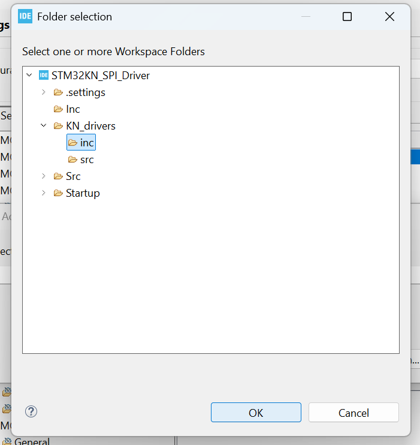

After clicking the **Add** button, the **Add directory path** window opens.

Click:

`Workspace...`

Using **Workspace** is usually the better option for folders that are already inside the STM32CubeIDE project. It keeps the path project-relative instead of depending on an absolute path from the computer.

In the folder selection window, expand the project and select the custom include folder.

In this example, select:

`STM32KN_SPI_Driver/KN_drivers/inc`

This is the folder that will contain the custom driver header files.

Header files usually have the `.h` extension, for example:

```c
#include "kn_spi.h"
```

So if custom low-level drivers, reusable modules, or board support headers are placed inside `KN_drivers/inc`, the compiler must know this folder exists.

After selecting the `inc` folder, click:

`OK`

This adds the custom include directory to the compiler include path list.

## Step 10: Confirm the Include Path Was Added
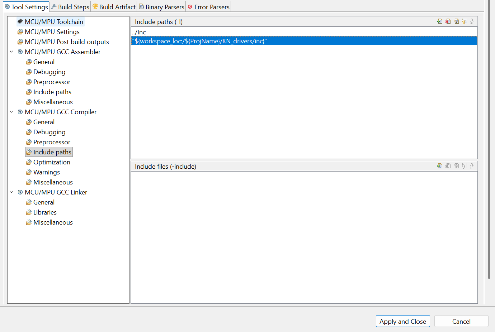

After selecting the custom `inc` folder, it should appear in the **Include paths (-I)** list.

In this example, the new path is shown as:

`${workspace_loc:/${ProjName}/KN_drivers/inc}`

This is correct.

It means STM32CubeIDE added the path relative to the current workspace and project name. This is better than a fixed absolute path because the project is easier to move, copy, or share.

At this point, the compiler can now find header files placed inside:

`KN_drivers/inc`

For example, a source file can now include a custom driver header like this:

```c
#include "kn_spi.h"
```

Before clicking **Apply and Close**, do one more important check.

Fresh empty STM32CubeIDE projects can sometimes have an FPU setting that causes build errors later, especially if the floating-point configuration does not match the selected MCU or generated startup/build options.

So before closing the properties window, check the FPU-related setting also.

If it is already configured correctly, leave it as it is.

If it is not configured correctly, fix it before applying the settings.

For this guide, the checklist before clicking **Apply and Close** is:

- custom include path is added
- `Exclude resource from build` was checked earlier
- FPU setting is checked and corrected if needed

Do not click **Apply and Close** until these checks are done.

## Step 11: Check the MCU and FPU Settings
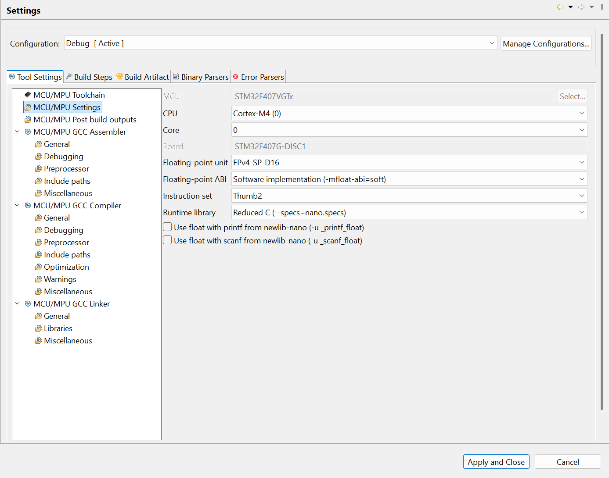

Before applying the project settings, also check:

`MCU/MPU Settings`

This page contains the selected MCU, CPU core, floating-point unit, floating-point ABI, instruction set, and runtime library.

For this example project, the selected MCU is:

`STM32F407VGTx`

This MCU uses a Cortex-M4 core and has a single-precision hardware FPU.

The important part here is to keep the floating-point configuration consistent.

In the screenshot:

- `Floating-point unit` is set to `FPv4-SP-D16`
- `Floating-point ABI` is set to `Software implementation (-mfloat-abi=soft)`
- `Instruction set` is set to `Thumb2`
- `Runtime library` is set to `Reduced C (--specs=nano.specs)`

For a simple empty project where the goal is to avoid floating-point ABI or linker errors, this setup is acceptable because the ABI is set to software floating point.

However, this is not the hardware-FPU optimized setup.

Use this rule:

- if you want to avoid FPU-related build issues in a basic project, use `Software implementation (-mfloat-abi=soft)`
- if you want to actually use the STM32F407 hardware FPU for floating-point performance, use `FPv4-SP-D16` with a matching hardware floating-point ABI

The main mistake to avoid is mixing incompatible FPU/ABI settings between project files, libraries, Debug configuration, and Release configuration.

Also keep these unchecked unless the project specifically needs printing or scanning floating-point values:

- `Use float with printf from newlib-nano`
- `Use float with scanf from newlib-nano`

Those options increase code size and are not needed for normal driver development.

If this page is checked and the include path was already added, then click:

`Apply and Close`

## Step 12: Hardware FPU Setup for an Empty Project
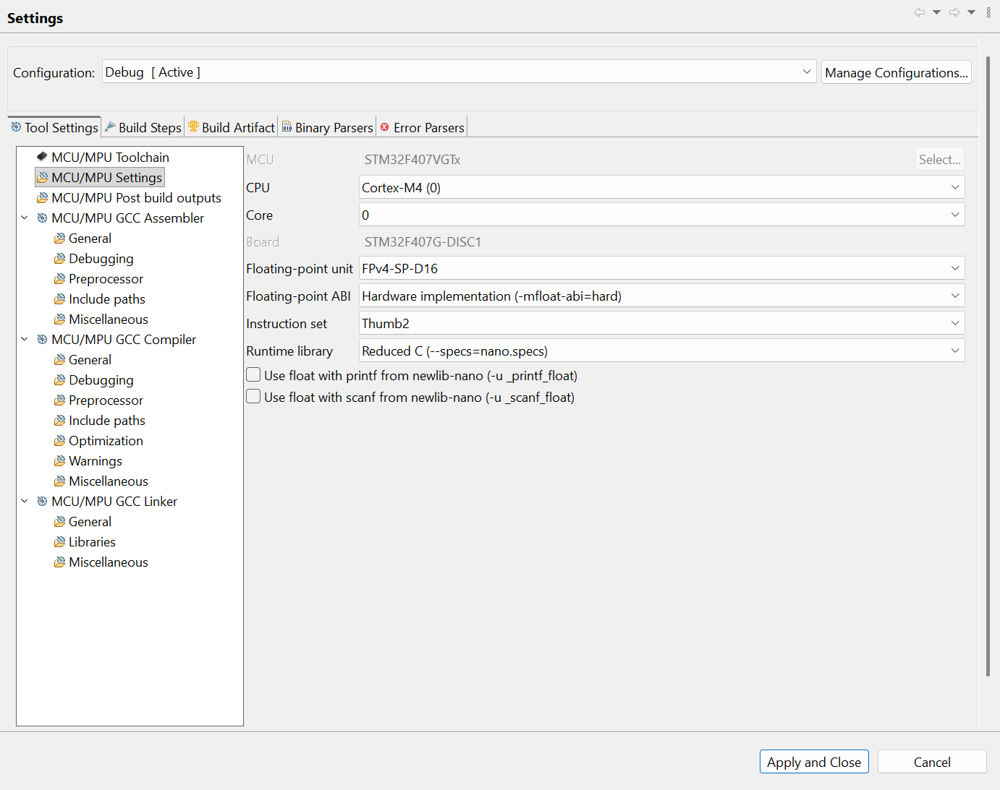

If the selected MCU has a hardware FPU, it can be used for faster floating-point calculations.

For STM32F407, the MCU has a Cortex-M4F core with a single-precision FPU. This is useful for sensor calculations, filters, calibration formulas, control loops, and other math-heavy embedded code.

For hardware FPU usage, the project settings should be consistent:

- `Floating-point unit`: `FPv4-SP-D16`
- `Floating-point ABI`: `Hardware implementation (-mfloat-abi=hard)`
- `Instruction set`: `Thumb2`

This makes the compiler generate hardware FPU instructions.

However, in an **empty STM32 project**, changing only the project properties is not enough.

The FPU must also be enabled at startup before `main()` runs.

In normal CubeMX-generated projects, this is usually handled in `system_stm32f4xx.c` through `SystemInit()`.

In an empty project, the startup file still calls `SystemInit()` before `main()`, but the default `SystemInit()` may be only a weak empty function. That means the user must provide a real `SystemInit()` implementation.

The startup flow is:

```text
Reset_Handler
|-- set stack pointer
|-- call SystemInit()
`-- call main()
```

So do not call `SystemInit()` manually from `main()`. It is already called by the startup code.

For an empty STM32F407 project, a minimal hardware-FPU-ready `main.c` can look like this:

```c
#include <stdint.h>
#include "main.h"

void SystemInit(void)
{
#if (__FPU_PRESENT == 1U) && (__FPU_USED == 1U)
    SCB->CPACR |= ((3UL << (10U * 2U)) | (3UL << (11U * 2U)));
    __DSB();
    __ISB();
#endif
}

int main(void)
{
    /* Loop forever */
    for (;;);
}
```

This works only if the device and CMSIS headers are correctly included.

For this project structure, the required pieces are:

- `main.h` must include the device header
- the device header, such as `stm32f407xx.h`, must define `__FPU_PRESENT`
- `core_cm4.h` must be available because it defines `SCB`, `__DSB()`, and `__ISB()`
- the compiler settings must use the same FPU mode for the whole project

The important macros are:

```c
#define __FPU_PRESENT 1U
```

and the compiler-generated CMSIS macro:

```c
__FPU_USED
```

When `__FPU_PRESENT == 1U` and `__FPU_USED == 1U`, the FPU enable code gives access to coprocessors CP10 and CP11 through the `SCB->CPACR` register.

After adding this code, remove the default empty-project warning block if it exists:

```c
#if !defined(__SOFT_FP__) && defined(__ARM_FP)
  #warning "FPU is not initialized, but the project is compiling for an FPU. Please initialize the FPU before use."
#endif
```

That block is only a reminder from the empty project template. It does not check whether `SystemInit()` was actually implemented, so it can still warn even after the FPU is correctly initialized.

The safer long-term organization is to place `SystemInit()` in a separate system file, for example:

```text
Src/system_stm32f407xx.c
```

and keep `main.c` for application code only.

For this tracked git project, the required support files are already present:

- CMSIS Cortex-M4 core header: `Inc/core_cm4.h`
- CMSIS compiler headers: `Inc/cmsis_compiler.h`, `Inc/cmsis_gcc.h`
- device header: `KN_drivers/inc/stm32f407xx.h`
- project header: `Inc/main.h`

So the missing part in an empty project is usually not the header files, but making sure the startup/system initialization path is completed correctly.

## Step 13: Verify the FPU with Debugger-Visible Float Calculations
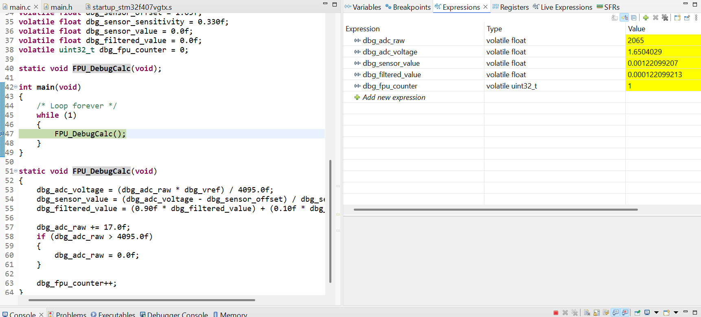

After the hardware FPU setup is done, it is useful to test floating-point arithmetic without adding UART, ITM, SWV, or `printf`.

The simplest way is to use `volatile` floating-point variables and watch them in the debugger.

Use `volatile` because it prevents the compiler from optimizing the variables away. That makes the values visible in the **Expressions** or **Live Expressions** window during debugging.

A minimal debugger-friendly FPU test can look like this:

```c
#include <stdint.h>
#include "main.h"

void SystemInit(void)
{
#if (__FPU_PRESENT == 1U) && (__FPU_USED == 1U)
    SCB->CPACR |= ((3UL << (10U * 2U)) | (3UL << (11U * 2U)));
    __DSB();
    __ISB();
#endif
}

volatile float dbg_adc_raw = 2048.0f;
volatile float dbg_vref = 3.3f;
volatile float dbg_adc_voltage = 0.0f;
volatile float dbg_sensor_offset = 1.65f;
volatile float dbg_sensor_sensitivity = 0.330f;
volatile float dbg_sensor_value = 0.0f;
volatile float dbg_filtered_value = 0.0f;
volatile uint32_t dbg_fpu_counter = 0;

static void FPU_DebugCalc(void);

int main(void)
{
    while (1)
    {
        FPU_DebugCalc();
    }
}

static void FPU_DebugCalc(void)
{
    dbg_adc_voltage = (dbg_adc_raw * dbg_vref) / 4095.0f;
    dbg_sensor_value = (dbg_adc_voltage - dbg_sensor_offset) / dbg_sensor_sensitivity;
    dbg_filtered_value = (0.90f * dbg_filtered_value) + (0.10f * dbg_sensor_value);

    dbg_adc_raw += 17.0f;
    if (dbg_adc_raw > 4095.0f)
    {
        dbg_adc_raw = 0.0f;
    }

    dbg_fpu_counter++;
}
```

Add these variables to the debugger **Expressions** window:

- `dbg_adc_raw`
- `dbg_adc_voltage`
- `dbg_sensor_value`
- `dbg_filtered_value`
- `dbg_fpu_counter`

Place a breakpoint at the function call or inside `FPU_DebugCalc()`.

On the first stop, the variables may still show their default initialized values.

After one completed call to `FPU_DebugCalc()`, the expected values are approximately:

```text
dbg_adc_raw         = 2065
dbg_adc_voltage     = 1.6504029
dbg_sensor_value    = 0.001221
dbg_filtered_value  = 0.0001221
dbg_fpu_counter     = 1
```

This is correct because the first calculation starts with:

```text
dbg_adc_raw = 2048
dbg_vref    = 3.3
```

The voltage calculation is:

```text
dbg_adc_voltage = (2048 * 3.3) / 4095
                = 1.6504029 approximately
```

Then:

```text
dbg_sensor_value = (1.6504029 - 1.65) / 0.330
                 = 0.001221 approximately
```

And the filtered value starts from zero:

```text
dbg_filtered_value = (0.90 * 0.0) + (0.10 * 0.001221)
                   = 0.0001221 approximately
```

Finally:

```text
dbg_adc_raw += 17
dbg_adc_raw = 2065
dbg_fpu_counter = 1
```

Small decimal differences are normal because `float` uses single-precision binary floating-point representation.

### Hardware FPU vs Software Floating Point

Both hardware FPU mode and software floating-point mode can produce the same kind of numeric result for normal `float` calculations.

The difference is how the work is done.

With software floating point, the compiler uses software helper routines from the ARM runtime library. The answer is still valid, but the CPU spends more instructions doing the calculation.

With hardware FPU enabled, the Cortex-M4F executes dedicated floating-point instructions such as:

```text
vmul.f32
vdiv.f32
vadd.f32
```

So hardware FPU is usually faster and uses fewer CPU cycles.

The FPU is not like DMA.

DMA can move data independently while the CPU does other work. The FPU is instead a math execution unit attached to the CPU core. The CPU still executes instructions, but floating-point operations are handled by dedicated hardware instead of long software routines.

For STM32F407, the hardware FPU is single precision. That means it accelerates `float` very well.

Use `float` literals with the `f` suffix:

```c
3.3f
4095.0f
0.90f
```

Avoid accidentally using `double` literals like:

```c
3.3
4095.0
0.90
```

because plain decimal constants are `double` in C.

The STM32F407 does not have a double-precision hardware FPU. So `double` calculations are normally handled in software and are slower.

Software `double` can be more mathematically precise than `float`, but that does not automatically make it better for embedded sensor work.

For example, a 12-bit ADC has only 4096 possible counts. With a 3.3 V reference:

```text
ADC step size = 3.3 / 4095
              = 0.000805 V approximately
```

That is about 0.805 mV per ADC count.

A `float` already has more precision than the ADC measurement itself in many practical sensor applications. Using `double` may only show more decimal digits without adding real sensor accuracy.

Use this rule:

- use hardware `float` for STM32F407 sensor math, filters, calibration, PID, control loops, and driver calculations
- use software floating point only when simplicity or compatibility is more important than speed
- use `double` only when the project truly needs higher numerical precision and can afford the extra code size and execution time

For this guide and this MCU, the recommended practical setup is:

- `FPv4-SP-D16`
- `Hardware implementation (-mfloat-abi=hard)`
- `SystemInit()` enables the FPU before `main()`
- calculations use `float` and `f` suffix constants
- debugger verification is done through `volatile` variables, not UART or `printf`
